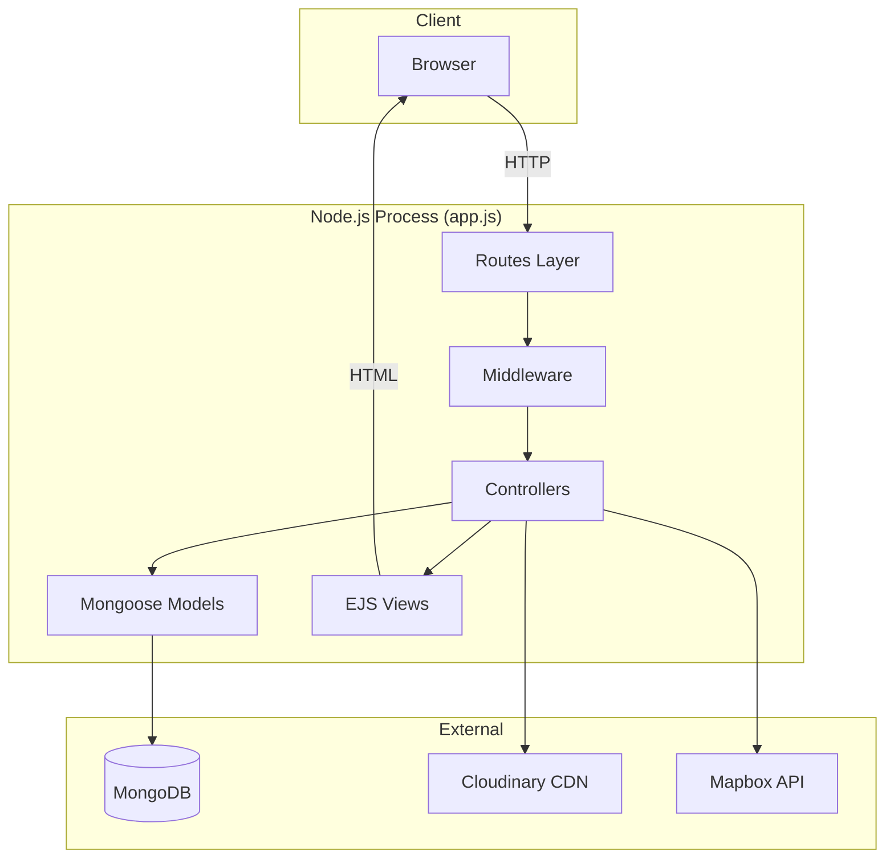
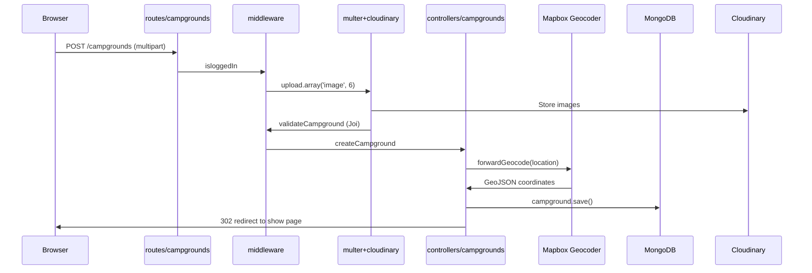
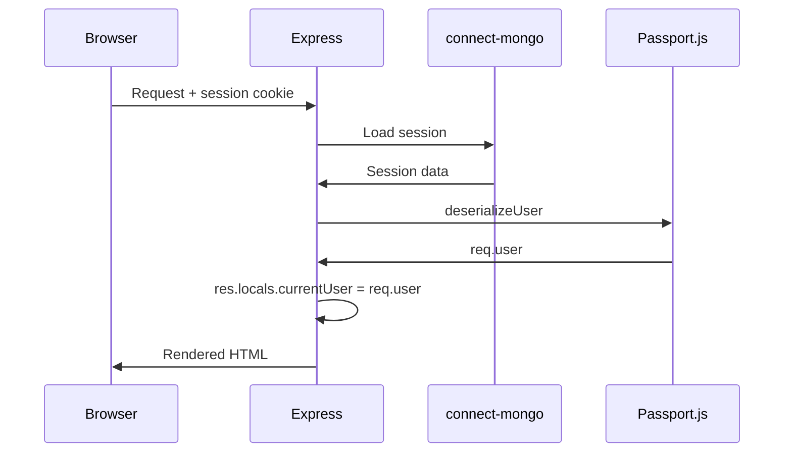
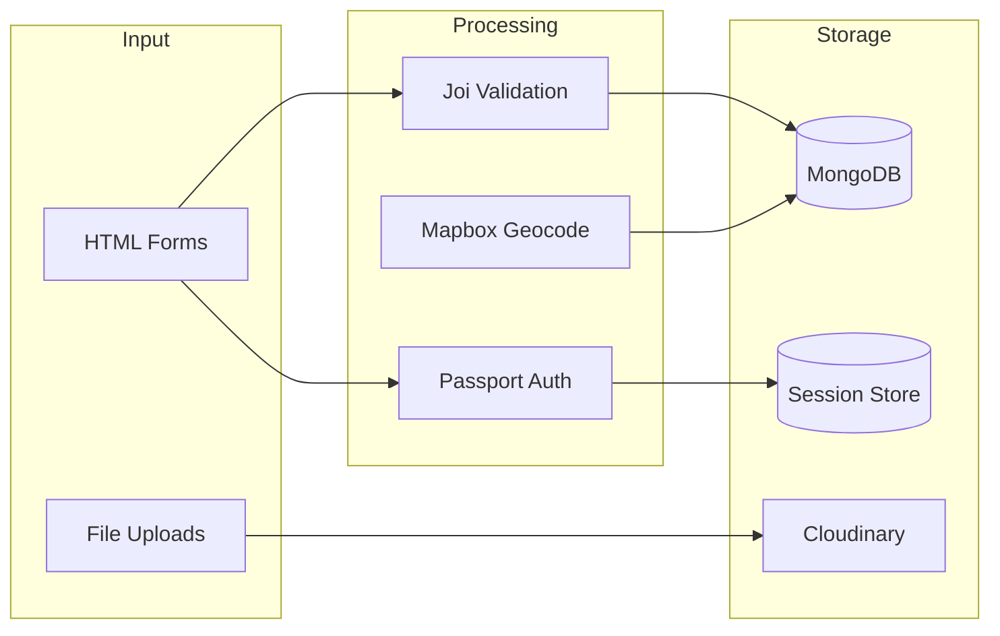

# YelpCamp — Architecture Documentation

> **Last audited:** 2026-05-31  
> **Style:** Monolithic server-rendered MVC (Express + EJS)

---

## Architectural Overview

YelpCamp follows a classic **Express MVC** pattern with server-side rendering. There is no separate frontend SPA, API layer, or microservices. All business logic runs in a single Node.js process.



---

## Layer Boundaries

| Layer | Directory | Responsibility |
|-------|-----------|----------------|
| **Entry** | `app.js` | App bootstrap, middleware stack, route mounting, error handler |
| **Routes** | `routes/` | HTTP verb + path mapping, middleware chain composition |
| **Controllers** | `controllers/` | Request handling, orchestration, response rendering |
| **Models** | `models/` | Mongoose schemas, hooks, virtuals |
| **Views** | `views/` | EJS templates, layouts, partials |
| **Middleware** | `middleware.js` | Auth, validation, authorization |
| **Schemas** | `schemas.js` | Joi validation definitions |
| **Utils** | `utils/` | Error classes, async wrapper, env validation |
| **Static** | `public/` | CSS, client JS |
| **Config** | `cloudinary/` | Third-party SDK configuration |

---

## Module Dependency Map

```mermaid
graph LR
    app[app.js] --> routes_users[routes/users]
    app --> routes_cg[routes/campgrounds]
    app --> routes_rev[routes/reviews]
    app --> middleware[middleware.js]
    app --> models[models/*]

    routes_cg --> ctrl_cg[controllers/campgrounds]
    routes_cg --> cloudinary[cloudinary/]
    routes_cg --> middleware

    routes_rev --> ctrl_rev[controllers/reviews]
    routes_rev --> middleware

    routes_users --> ctrl_users[controllers/users]
    routes_users --> passport[passport]

    ctrl_cg --> models
    ctrl_cg --> cloudinary
    ctrl_cg --> mapbox[@mapbox/mapbox-sdk]

    middleware --> schemas[schemas.js]
    middleware --> models
```

---

## Request Flow — Create Campground



---

## Request Flow — Authenticated Page



---

## Route Map

| Method | Path | Controller | Middleware |
|--------|------|------------|------------|
| GET | `/` | inline in app.js | — |
| GET | `/register` | users.renderRegister | — |
| POST | `/register` | users.register | catchAsync |
| GET | `/login` | users.renderLogin | — |
| POST | `/login` | users.login | passport.authenticate |
| GET | `/logout` | users.logout | — |
| GET | `/users/:id` | users.showProfile | catchAsync |
| GET | `/campgrounds` | campgrounds.index | catchAsync |
| GET | `/campgrounds/new` | campgrounds.renderNewForm | isloggedIn |
| POST | `/campgrounds` | campgrounds.createCampground | isloggedIn, multer, validate, catchAsync |
| GET | `/campgrounds/:id` | campgrounds.showCampground | catchAsync |
| GET | `/campgrounds/:id/edit` | campgrounds.renderEditForm | isloggedIn, isAuthor |
| PUT | `/campgrounds/:id` | campgrounds.updateCampground | isloggedIn, isAuthor, multer, validate |
| DELETE | `/campgrounds/:id` | campgrounds.deleteCampground | isloggedIn, isAuthor |
| POST | `/campgrounds/:id/reviews` | reviews.createReview | isloggedIn, validateReview |
| POST | `.../reviews/:reviewId/like` | reviews.toggleLikeReview | isloggedIn, reviewBelongsToCampground |
| POST | `.../reviews/:reviewId/replies` | reviews.createReply | isloggedIn, reviewBelongsToCampground, validateReply |
| DELETE | `.../reviews/:reviewId/replies/:replyId` | reviews.deleteReply | isloggedIn, isReplyAuthor |
| DELETE | `.../reviews/:reviewId` | reviews.deleteReview | isloggedIn, isReviewAuthor |

---

## Middleware Stack Order (app.js)

1. `dotenv` (non-production)
2. `validateEnv()` (production only)
3. `express.urlencoded`
4. `method-override`
5. `express.static`
6. `express-session` + MongoStore
7. `connect-flash`
8. `passport.initialize` + `passport.session`
9. Locals middleware (`currentUser`, flash messages)
10. Route handlers
11. 404 catch-all → `ExpressError`
12. Global error handler

---

## Data Flow



---

## Technology Decisions

| Decision | Choice | Rationale (inferred) |
|----------|--------|---------------------|
| Rendering | EJS + ejs-mate layouts | Bootcamp standard, simple SSR |
| ODM | Mongoose 7 | MongoDB schema validation |
| Auth | Passport local + sessions | Common pattern for SSR apps |
| File upload | Multer → Cloudinary | Offload storage to CDN |
| Validation | Joi | Declarative server-side validation |
| Maps | Mapbox GL JS (client) + SDK (server geocode) | Industry standard |
| Async errors | catchAsync wrapper | Avoid try/catch in every route |

---

## Architectural Strengths

- Clear separation of routes / controllers / models
- Consistent authorization middleware pattern
- Cascade delete hook for campground cleanup
- Test-friendly app export (`module.exports = app`)
- In-memory MongoDB for tests

---

## Architectural Weaknesses

- No service layer (controllers talk directly to models and external APIs)
- No repository pattern or dependency injection
- Duplicate query logic (paginate + find for map data)
- No API versioning or content negotiation
- No event-driven architecture for side effects (Cloudinary cleanup in model hook)
- Mixed concerns in controllers (geocoding, file handling, rendering)
- No health check or readiness endpoint

---

## Scaling Considerations

| Concern | Current State | Impact at Scale |
|---------|---------------|-----------------|
| Single Node process | Yes | Vertical scaling only |
| Session store | MongoDB | Shared across instances if configured |
| File uploads | Direct to Cloudinary | Scales with Cloudinary |
| DB connections | Default pool | May need tuning |
| Static assets | Served by Express | Should use CDN in production |
| Geocoding | Synchronous per request | Rate limit risk |

---

## Related Documentation

- [DATABASE.md](./DATABASE.md)
- [../product/BUSINESS_LOGIC.md](../product/BUSINESS_LOGIC.md)
- [../audits/CODE_AUDIT.md](../audits/CODE_AUDIT.md)
