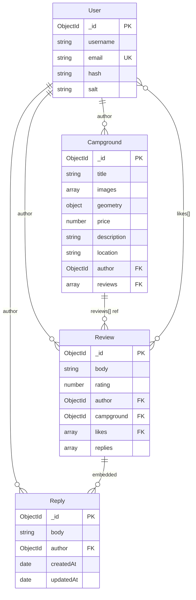

# YelpCamp — Database Documentation

> **Last audited:** 2026-05-31  
> **Engine:** MongoDB via Mongoose 7.x

---

## Connection Configuration

| Environment | Connection | Notes |
|-------------|------------|-------|
| Development | `process.env.MONGO_URL` | dotenv loaded |
| Production | `process.env.MONGO_URL` | Validated at startup |
| Test | MongoMemoryServer URI | Isolated per test run |

**Legacy options used:** `useNewUrlParser`, `useUnifiedTopology` (deprecated in Mongoose 6+, no-op)

**Session store:** Separate `connect-mongo` collection using same `MONGO_URL`

---

## Schema Diagram



---

## Collections

### `users`

| Index | Field | Type | Notes |
|-------|-------|------|-------|
| `_id` | Primary | Auto | |
| `email_1` | email | Unique | Mongoose `unique: true` |

**Missing indexes:** None critical for current query patterns.

### `campgrounds`

| Index | Field | Status |
|-------|-------|--------|
| `_id` | Primary | ✅ |
| `author_1` | author | ✅ |
| `geometry_2dsphere` | geometry | ✅ |
| `title_text_location_text` | title + location | ✅ (text) |

Search uses `$text` on the compound text index (see `controllers/campgrounds.js`).

### `reviews`

| Index | Field | Status |
|-------|-------|--------|
| `_id` | Primary | ✅ |
| `campground_1` | campground | ✅ |
| `author_1` | author | ✅ |

### `sessions` (connect-mongo)

Managed by connect-mongo. TTL via session cookie maxAge (7 days).

---

## Relationships

| Relationship | Type | Implementation |
|--------------|------|----------------|
| User → Campground | 1:N | `campground.author` ref |
| Campground → Review | 1:N | Bidirectional: `campground.reviews[]` + `review.campground` |
| User → Review (likes) | M:N | `review.likes[]` array of User IDs |
| Review → Reply | 1:N | Embedded subdocuments |

**Denormalization:** `campground.reviews[]` duplicates review IDs. Must stay in sync manually on create/delete.

---

## Query Patterns

| Operation | Query | Location | Concern |
|-----------|-------|----------|---------|
| List campgrounds | `Campground.paginate(query, {page, limit: 8})` | controllers/campgrounds | Uses `$text` when search param present |
| Map GeoJSON | `Campground.find(query).select(...)` | controllers/campgrounds | **Unbounded** — loads ALL matching docs |
| Show campground | `findById().populate(reviews).populate(author)` | controllers/campgrounds | N+1 mitigated by populate |
| User profile campgrounds | `Campground.find({ author: id })` | controllers/users | Needs index on author |
| User profile reviews | `Review.find({ author: id }).populate('campground')` | controllers/users | Needs index on author |
| Auth check | `Campground.findById(id)` | middleware isAuthor | Extra query per protected route |
| Home stats | `countDocuments()` × 3 | app.js | OK at small scale |

---

## Data Integrity Risks

| Risk | Severity | Description |
|------|----------|-------------|
| Orphaned reviews | Medium | If `$pull` succeeds but `findByIdAndDelete` fails |
| Stale reviews[] array | Medium | No transactional guarantee on create/delete |
| Missing geometry | Low | Geocode failure prevents save |
| Duplicate reviews | Low | No unique constraint per user+campground |
| Cascade delete partial failure | Medium | Cloudinary delete may fail silently in hook |

**Recommendation:** Use MongoDB transactions for review create/delete operations.

---

## Hooks & Middleware

### Campground post `findOneAndDelete`

```javascript
// Deletes Cloudinary images + Review documents
CampgroundSchema.post('findOneAndDelete', async function (doc) { ... });
```

### Virtual: ImageSchema.thumbnail

Transforms Cloudinary URL for 200px thumbnails.

### Plugin: mongoose-paginate-v2

Enables `Campground.paginate()` for index page.

---

## Seed Data

| Script | Command | Behavior |
|--------|---------|----------|
| `seeds/index.js` | `npm run seed` | Deletes ALL campgrounds, creates 50 with seed user |
| `seeds/global_bootstrapping.js` | Manual only | Creates 7 international campgrounds + 3 users |

**Warning:** Seed scripts call `Campground.deleteMany({})` — destructive in shared environments.

---

## Scaling Concerns

| Scale | Database Concern | Mitigation |
|-------|------------------|------------|
| 1K campgrounds | Regex search slows | Text index / Atlas Search |
| 10K+ reviews | Populate on show page grows | Pagination of reviews |
| Multi-instance | Session store shared | Already using MongoStore ✅ |
| Geo queries | No 2dsphere index | Add index before geo features |
| Write-heavy | Single primary | Replica set + read preference |

---

## Recommended Index Additions

**Status:** Implemented 2026-05-31. See [../database/INDEX_MIGRATION.md](../database/INDEX_MIGRATION.md) for migration notes and benchmarks.

```javascript
// models/campground.js — applied
CampgroundSchema.index({ author: 1 });
CampgroundSchema.index({ geometry: '2dsphere' });
CampgroundSchema.index({ title: 'text', location: 'text' });

// models/review.js — applied
reviewSchema.index({ campground: 1 });
reviewSchema.index({ author: 1 });
```

---

## Related Documentation

- [ARCHITECTURE.md](./ARCHITECTURE.md)
- [../audits/PERFORMANCE_AUDIT.md](../audits/PERFORMANCE_AUDIT.md)
