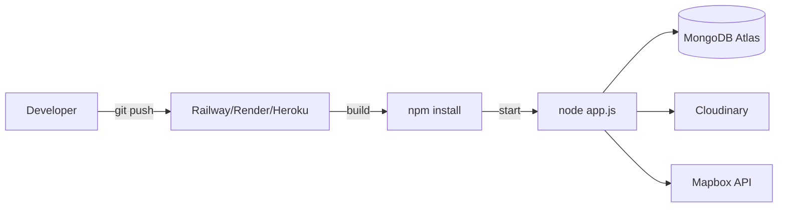

# YelpCamp — Operations Audit

> **Last audited:** 2026-05-31

---

## Executive Summary

YelpCamp is configured for basic PaaS deployment (Heroku/Railway/Render) but lacks enterprise operations infrastructure: no CI/CD, no monitoring, no structured logging, no health checks, and no infrastructure-as-code.

| Area | Status | Maturity |
|------|--------|----------|
| CI/CD | ❌ Not configured | Level 0 |
| Deployment | ⚠️ Procfile only | Level 1 |
| Environment management | ⚠️ .env.example | Level 1 |
| Secrets management | ⚠️ Env vars | Level 1 |
| Monitoring | ❌ None | Level 0 |
| Logging | ⚠️ console.log only | Level 0 |
| Alerting | ❌ None | Level 0 |
| Backup/DR | ❌ Not documented | Level 0 |
| Health checks | ❌ None | Level 0 |

---

## CI/CD

### Current State

- **No** `.github/workflows/` directory
- **No** GitLab CI, CircleCI, or Jenkins configuration
- **No** pre-commit hooks
- **No** automated test execution on push/PR

### Recommendations

| Action | Priority | Effort |
|--------|----------|--------|
| GitHub Actions: lint + test on PR | P1 | Low |
| npm audit in CI pipeline | P1 | Low |
| Automated deploy on main merge | P2 | Medium |
| Branch protection rules | P2 | Low |

**Suggested workflow:**

```yaml
name: CI
on: [push, pull_request]
jobs:
  test:
    runs-on: ubuntu-latest
    steps:
      - uses: actions/checkout@v4
      - uses: actions/setup-node@v4
        with:
          node-version: '18'
      - run: npm ci
      - run: npm test
      - run: npm audit --audit-level=high
```

---

## Deployment

### Current Configuration

| File | Purpose |
|------|---------|
| `Procfile` | `web: node app.js` — PaaS web dyno |
| `package.json` engines | Node >= 18 |
| `app.js` | SIGTERM handler for graceful shutdown ✅ |

### Deployment Model



### Missing Deployment Features

- No Dockerfile / container orchestration
- No blue-green or canary deployment
- No rollback procedure documented
- No build step (no transpilation needed)
- No asset compilation pipeline

### Recommendations

1. Document deployment steps in README
2. Add `/health` endpoint returning 200 + DB connectivity check
3. Configure `trust proxy` for secure cookies behind reverse proxy
4. Set `NODE_ENV=production` in hosting dashboard

---

## Environment Management

### Variables (`.env.example`)

| Variable | Dev | Test | Prod | Validated |
|----------|-----|------|------|-----------|
| PORT | ✅ | ✅ | ✅ | No |
| NODE_ENV | ✅ | ✅ | ✅ | Partial |
| MONGO_URL | ✅ | N/A (memory) | ✅ | Prod only |
| SESSION_SECRET | ✅ | ❌ | ✅ | Prod only |
| CLOUDINARY_* | ✅ | ❌ | ✅ | ❌ |
| MAPBOX_TOKEN | ✅ | ❌ | ✅ | ❌ |

### Recommendations

- Expand `validateEnv()` for all required production vars
- Use hosting provider secret management (Railway variables, Render env groups)
- Never commit `.env` files ✅ (in .gitignore)
- Add `.env.test` example for local test overrides

---

## Secrets Management

### Current State

- Secrets via environment variables (Twelve-Factor compliant ✅)
- **Critical issue:** Hardcoded credentials in `cloudinary-onboarding.js` ❌
- Dev session secret fallback in code ❌

### Recommendations

| Action | Priority |
|--------|----------|
| Rotate exposed Cloudinary credentials | P0 |
| Remove hardcoded secrets from repo | P0 |
| Add git-secrets or GitHub secret scanning | P1 |
| Require SESSION_SECRET in all non-test envs | P1 |
| Document secret rotation procedure | P2 |

---

## Monitoring & Observability

### Current State

- **Logging:** `console.log` / `console.error` only
- **Metrics:** None
- **Tracing:** None
- **APM:** None
- **Uptime monitoring:** None

### Recommendations

| Tool | Purpose | Priority |
|------|---------|----------|
| Structured logging (pino/winston) | JSON logs with request IDs | P1 |
| `/health` + `/ready` endpoints | Load balancer probes | P1 |
| Sentry / Rollbar | Error tracking | P2 |
| Datadog / New Relic | APM (at scale) | P3 |
| UptimeRobot / Pingdom | External uptime checks | P2 |

**Minimum viable observability:**

```javascript
// Add to app.js
app.get('/health', (req, res) => {
  const dbState = mongoose.connection.readyState;
  res.status(dbState === 1 ? 200 : 503).json({
    status: dbState === 1 ? 'ok' : 'degraded',
    uptime: process.uptime()
  });
});
```

---

## Logging

### Current Logging Points

| Location | Type | Content |
|----------|------|---------|
| `app.js:122` | info | Port number on startup |
| `app.js:33` | error | MongoDB connection error |
| `app.js:62` | error | Session store error |
| `seeds/*` | info | Seed progress |

### Gaps

- No request logging (morgan)
- No log levels
- No correlation IDs
- No sensitive data redaction policy
- Errors may expose internals in EJS error page

### Recommendations

See [LOGGING_GUIDE.md](../standards/LOGGING_GUIDE.md)

---

## Alerting

No alerting configured. Recommended alerts for production:

| Alert | Condition | Channel |
|-------|-----------|---------|
| App down | Health check fails 3× | Email/Slack |
| Error rate spike | > 10 errors/min | PagerDuty |
| DB connection lost | readyState !== 1 | Email |
| High response time | p95 > 2s | Dashboard |
| Disk/memory | > 80% utilization | Email |

---

## Backup & Disaster Recovery

### MongoDB

- **Assumption:** MongoDB Atlas with automated backups (if using Atlas)
- **Not documented** in repository
- Seed scripts can recreate demo data but not user-generated content

### Cloudinary

- Images stored in Cloudinary; no local backup
- Deletion is permanent (campground delete hook)

### Recommendations

1. Document MongoDB backup schedule (Atlas: continuous backup)
2. Document recovery procedure (RTO/RPO targets)
3. Test restore procedure quarterly

---

## Graceful Shutdown

✅ **Implemented:** SIGTERM handler closes MongoDB connection before exit (`app.js:124-128`)

**Missing:** Stop accepting new connections during shutdown (needs `server.close()`)

---

## Related Documentation

- [PRODUCTION_READINESS.md](./PRODUCTION_READINESS.md)
- [../standards/RELEASE_PROCESS.md](../standards/RELEASE_PROCESS.md)
