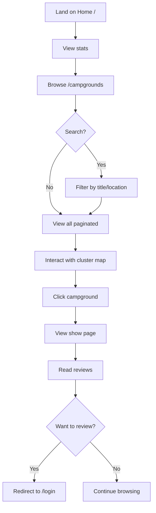
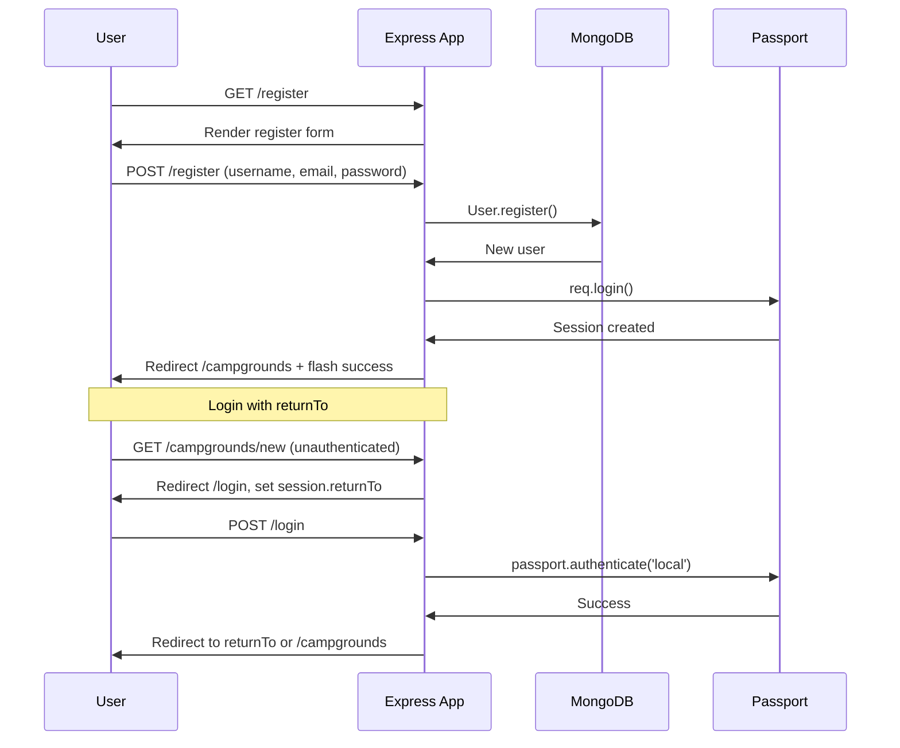
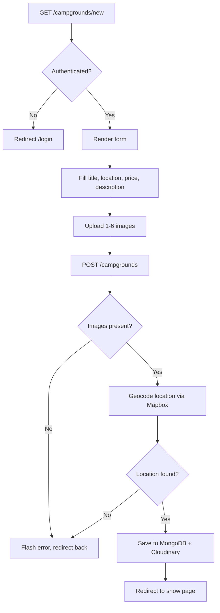
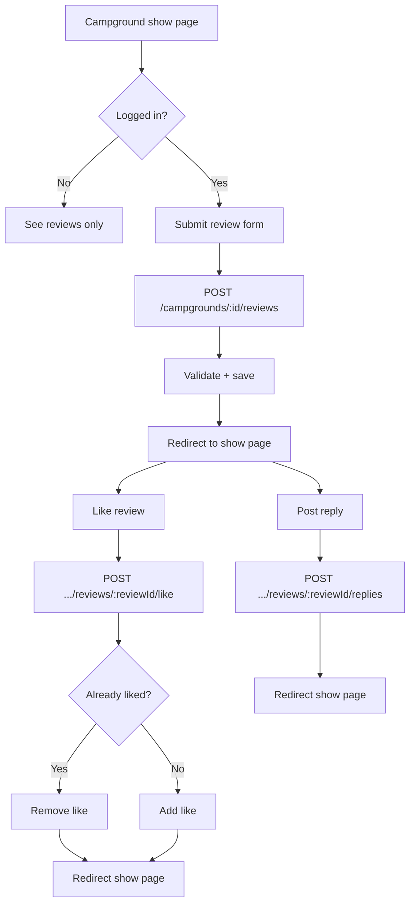
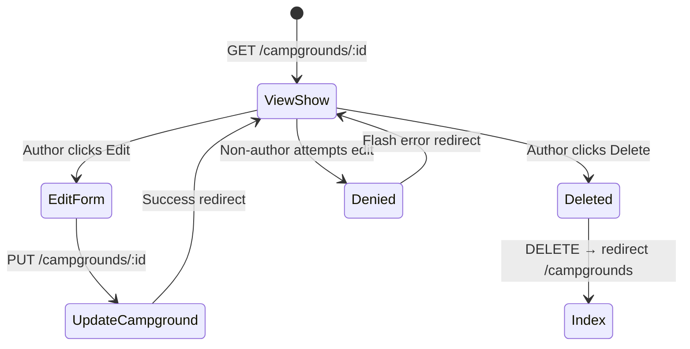

# YelpCamp — User Flow Analysis

> **Last audited:** 2026-05-31

---

## Entry Points

| Entry | URL | Auth Required |
|-------|-----|---------------|
| Home | `/` | No |
| Campground index | `/campgrounds` | No |
| Campground detail | `/campgrounds/:id` | No |
| Register | `/register` | No |
| Login | `/login` | No |
| User profile | `/users/:id` | No |

---

## User Journey Maps

### 1. Guest Discovery Flow

### 2. Registration & Login Flow

### 3. Create Campground Flow

### 4. Review & Social Interaction Flow

### 5. Edit / Delete Campground (Author Only)

---

## State Transitions

### Session States

| State | Transitions |
|-------|-------------|
| Anonymous | → Authenticated (login/register) |
| Authenticated | → Anonymous (logout) |
| Authenticated + returnTo | → Redirect to protected URL after login |

### Campground States

| State | Created By | Transitions |
|-------|-----------|-------------|
| Draft (N/A) | — | No draft state; publish on create |
| Published | POST /campgrounds | → Updated, → Deleted |
| Deleted | DELETE | Cascade deletes reviews + Cloudinary images |

### Review States

| State | Transitions |
|-------|-------------|
| Active | → Deleted (author only) |
| Liked by user N | Toggle like on/off |

---

## Edge Cases

| Scenario | Current Behavior | Risk |
|----------|------------------|------|
| Invalid campground ID | Flash error, redirect `/campgrounds` | Low |
| Non-author edit attempt | Flash error, redirect to show page | Low |
| Review on wrong campground URL | Redirect with "Review not found" | Medium — IDOR prevented |
| Geocode failure | Flash error, stay on form | Low |
| Duplicate email registration | Flash error with passport message | Low |
| Upload > 6 images | Multer error → flash + redirect back | Low |
| Upload > 2MB | Multer LIMIT_FILE_SIZE → error handler | Low |
| Empty reply body | Joi validation → 400 error page | Low |
| Access profile of non-existent user | Flash error, redirect `/campgrounds` | Low |
| `register` handler error with `next` | **Bug:** `next` undefined in catch block | Medium |
| Default star rating = 1 | User may submit 1-star without intending | Low UX |
| Search regex injection | User input passed to `$regex` | Medium — ReDoS potential |

---

## Authorization Matrix

| Action | Guest | Auth User | Author | Review Author |
|--------|-------|-----------|--------|---------------|
| View campgrounds | ✅ | ✅ | ✅ | ✅ |
| Create campground | ❌ | ✅ | — | — |
| Edit/delete campground | ❌ | ❌ | ✅ own | — |
| Post review | ❌ | ✅ | ✅ | — |
| Delete review | ❌ | ❌ | — | ✅ own |
| Like review | ❌ | ✅ | ✅ | ✅ |
| Post reply | ❌ | ✅ | ✅ | ✅ |
| Delete reply | ❌ | ❌ | — | ✅ own reply |

---

## UI Layout Patterns

| Page | Layout | Notes |
|------|--------|-------|
| Most pages | `layouts/boilerplate.ejs` | Navbar, flash, footer, Mapbox CDN |
| Auth pages | `layouts/auth.ejs` | Minimal layout for login/register |
| Home | Custom hero in `home.ejs` | Stats from DB counts |

---

## Related Documentation

- [BUSINESS_LOGIC.md](./BUSINESS_LOGIC.md)
- [../architecture/ARCHITECTURE.md](../architecture/ARCHITECTURE.md)
- [../security/SECURITY_AUDIT.md](../security/SECURITY_AUDIT.md)
