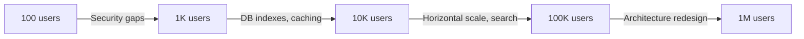

# YelpCamp — Scaling Roadmap

> **Last updated:** 2026-05-31

---

## Scale Tiers

### Tier 1: 100 Users

**Infrastructure:** Single PaaS dyno, Atlas M0/M2, Cloudinary free

| Component | Configuration |
|-----------|---------------|
| Node instances | 1 |
| MongoDB | Shared cluster, 512MB |
| Caching | None |
| CDN | None |
| Cost | $0-7/month |

**Actions:** Security P0 fixes, health check

---

### Tier 2: 1,000 Users

**Infrastructure:** Single dyno (upgraded), Atlas M10

| Component | Configuration |
|-----------|---------------|
| Node instances | 1-2 |
| MongoDB | Dedicated M10, indexes added |
| Caching | In-memory GeoJSON cache |
| CDN | Static assets via CloudFront/similar |
| Cost | $16-107/month |

**Actions:** Indexes, CI/CD, rate limiting, error tracking

---

### Tier 3: 10,000 Users

**Infrastructure:** 2-4 dynos, Atlas M30, Redis

| Component | Configuration |
|-----------|---------------|
| Node instances | 2-4 (horizontal) |
| MongoDB | M30+, connection pool tuning |
| Caching | Redis for sessions + GeoJSON |
| CDN | Full static + image optimization |
| Search | MongoDB text index or Atlas Search |
| Cost | $107-439/month |

**Actions:** Load testing, review pagination, separate map API, APM

---

### Tier 4: 100,000 Users

**Infrastructure:** Auto-scaling, multi-AZ, read replicas

| Component | Configuration |
|-----------|---------------|
| Node instances | Auto-scaling group |
| MongoDB | Replica set, read preference |
| Caching | Redis cluster |
| Search | Elasticsearch/Atlas Search |
| Queue | Bull/SQS for async tasks |
| Cost | $539-1724/month |

**Actions:** API layer, microservices evaluation, WAF, multi-region planning

---

### Tier 5: 1,000,000 Users

**Not achievable on current architecture.** Requires:

- Microservices or modular monolith
- Multi-region active-active
- Dedicated search, media, and auth services
- Edge computing for map tiles
- 24/7 SRE team

---

## Scaling Bottleneck Timeline

| Bottleneck | Appears At | Solution |
|------------|------------|----------|
| Unbounded map query | ~500 campgrounds | Cache + bounds filter |
| Regex search | ~1K campgrounds | Text index |
| Review populate | ~50 reviews/campground | Pagination |
| Single Node process | ~5K concurrent | Horizontal scaling |
| Session in MongoDB | ~10K concurrent | Redis session store |
| Mapbox geocode rate | High create volume | Queue + cache geocodes |

---

## Related

- [../operations/PRODUCTION_READINESS.md](../operations/PRODUCTION_READINESS.md)
- [../audits/PERFORMANCE_AUDIT.md](../audits/PERFORMANCE_AUDIT.md)
