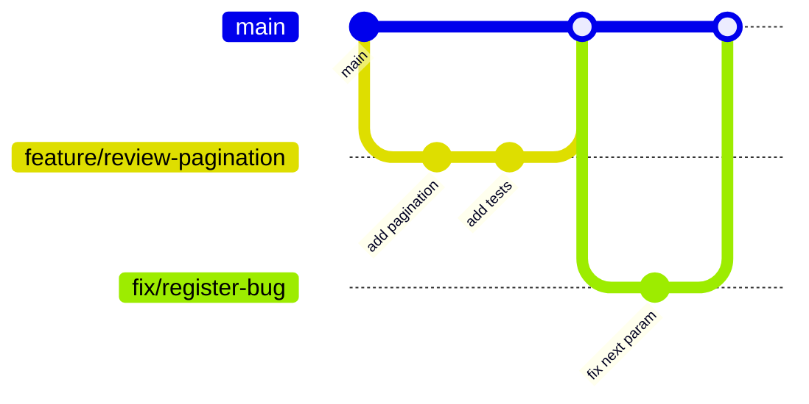

# Branching Strategy — YelpCamp

---

## Model: GitHub Flow (Simplified)

Suitable for small team / solo developer with continuous deployment aspirations.



---

## Branch Types

| Prefix | Use | Example |
|--------|-----|---------|
| `feature/` | New functionality | `feature/campground-favorites` |
| `fix/` | Bug fixes | `fix/register-error-handler` |
| `docs/` | Documentation only | `docs/security-audit` |
| `chore/` | Maintenance, deps | `chore/npm-audit-fix` |
| `refactor/` | No behavior change | `refactor/geocode-helper` |

---

## Main Branch

- Always deployable (target state)
- Protected: require PR, require passing tests
- No direct commits (when team > 1)

---

## Long-Lived Branches

Not used. No `develop`, `staging`, or `release/*` branches for this project size.

For staging environment: deploy `main` to staging, promote to production after verification.

---

## Hotfix Process

```bash
git checkout main
git pull
git checkout -b fix/critical-security-issue
# fix, test
git commit -m "Remove exposed credentials"
# PR → merge → deploy immediately
```

---

## Related

- [GIT_WORKFLOW.md](./GIT_WORKFLOW.md)
- [RELEASE_PROCESS.md](./RELEASE_PROCESS.md)
